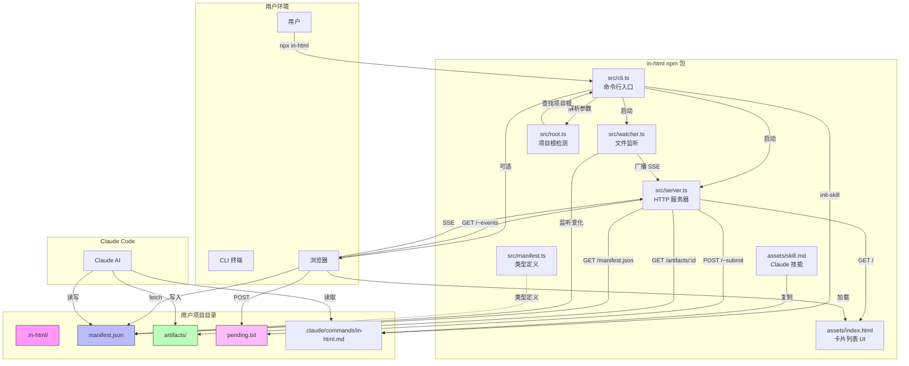

# in-html 架构图



## 数据流

```
┌─────────────────────────────────────────────────────────────────┐
│                        用户工作流                                │
├─────────────────────────────────────────────────────────────────┤
│                                                                 │
│  1. 用户运行 npx in-html                                        │
│     ↓                                                           │
│  2. 服务器启动，浏览器打开                                        │
│     ↓                                                           │
│  3. 用户在 CLI 中与 Claude 对话                                  │
│     ↓                                                           │
│  4. Claude 生成 HTML → 写入 artifacts/0001.html                  │
│     ↓                                                           │
│  5. Claude 更新 manifest.json                                   │
│     ↓                                                           │
│  6. Watcher 检测变化 → 广播 SSE                                  │
│     ↓                                                           │
│  7. 浏览器收到事件 → 刷新卡片列表                                 │
│     ↓                                                           │
│  8. 用户点击卡片 → 全屏查看 HTML                                  │
│                                                                 │
└─────────────────────────────────────────────────────────────────┘
```

## 组件职责

| 组件 | 职责 |
|------|------|
| `cli.ts` | 命令行解析、启动服务器、初始化技能 |
| `server.ts` | HTTP 路由、SSE 推送、提交处理 |
| `watcher.ts` | 监听 manifest.json 变化、50ms 防抖 |
| `manifest.ts` | 类型定义、读写 helpers |
| `root.ts` | 向上查找 .git/package.json |
| `index.html` | 卡片列表 UI、SSE 连接、提交表单 |
| `skill.md` | Claude Code 技能定义 |
